

    
  
  

*Building hands-on, employer-facing projects across cloud infrastructure and full-stack web development.*

&nbsp;&nbsp;
&nbsp;&nbsp;

 

## 👨‍💻 About Me

I'm a developer based in **Kuala Lumpur, Malaysia**, focused on building a structured portfolio across two tracks - **Cloud DevOps & Systems** and **Web Development**. My goal is to work in IT support and cloud infrastructure, with a longer-term path toward DevOps engineering.

 

## 🎓 Certifications & Badges

  <!-- ===== OTHER CERTIFICATIONS ===== -->
  <!-- KodeKloud Docker -->
  <a href="https://engineer.kodekloud.com/certificate-verification/5a1397be-3841-4ea6-a61b-d82b2633588d">
    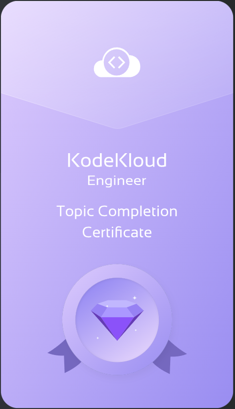
  </a>
  &nbsp;

  <!-- OPSWAT ICIP -->
  <a href="https://www.credly.com/badges/30fca971-22b7-46ed-b702-d11826c4c88c/public_url">
    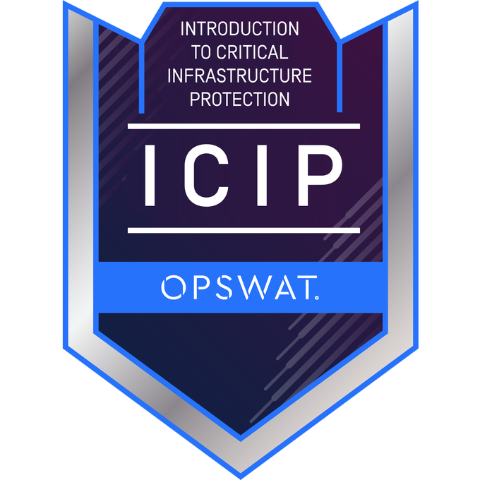
  </a>
  &nbsp;

  <!-- Agentic AI for All -->
  
  &nbsp;

  <!-- Data Analytics Job Simulation -->
  
  &nbsp;

  <!-- CompTIA IT Fundamentals (ITF+) -->
  <a href="https://www.credly.com/badges/fd0fc77b-c6cc-42c5-b579-0efd2df05712/public_url">
    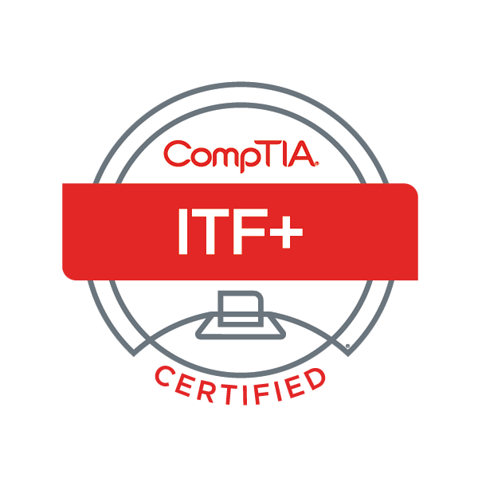
  </a>
  &nbsp;

  <!-- AWS AI Practitioner Challenge -->
  <a href="https://www.udacity.com/certificate/e/7cc36496-3b05-11f1-8205-5f346dcdac46">
    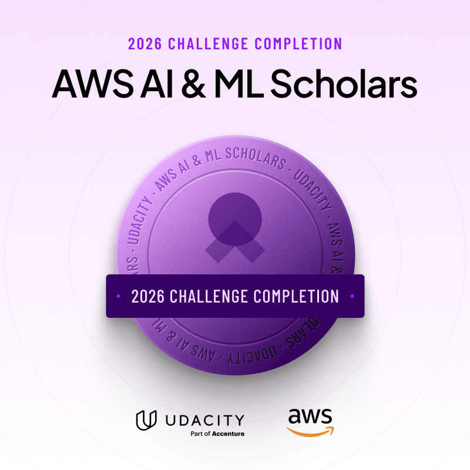
  </a>
  &nbsp;

  <!-- ===== RAKYAT DIGITAL GROUP ===== -->
  <!-- AI AWARE BADGE -->
  <a href="https://portal.rakyatdigital.gov.my/#/badge?id=U2FsdGVkX181Jt6rX0R6RG5trFWYZwF72b9ONxWiOs1L2a3S4hW6iz9sVEzSuip87Aip1L2u3SeEpb">
    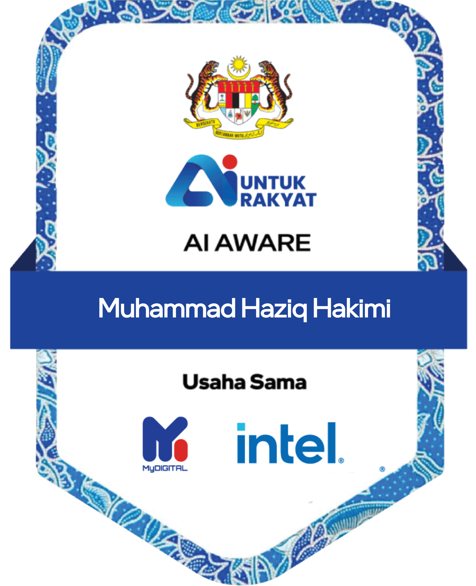
  </a>
  &nbsp;

  <!-- AI APPRECIATE BADGE -->
  <a href="https://portal.rakyatdigital.gov.my/#/badge?id=U2FsdGVkX19yjqLCdwFMtJ3nfaIwokI78DUhIfS6nioBSNo30syRLv3TglDHWGiR">
    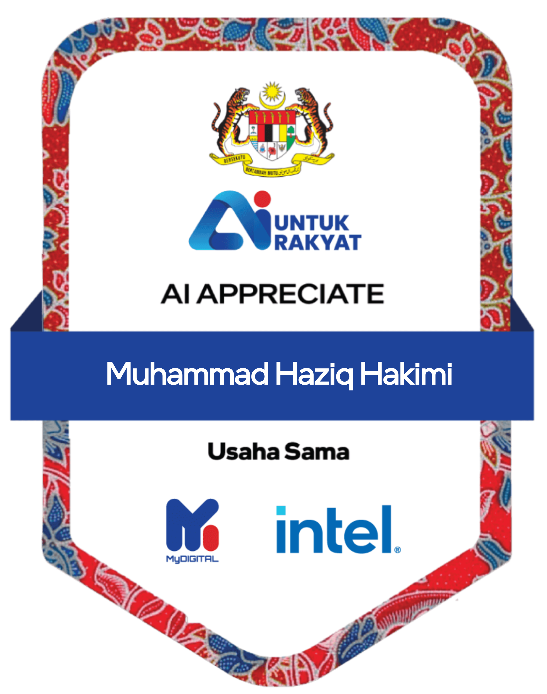
  </a>
  &nbsp;

  <!-- ===== DATACAMP GROUP ===== -->
  <!-- DataCamp - Joining Data in SQL -->
  <a href="https://www.datacamp.com/completed/statement-of-accomplishment/course/0fac885faeb84e6a0356df5356b6a3197e63cd4b?utm_medium=organic_social&utm_campaign=sharewidget&utm_content=soa">
    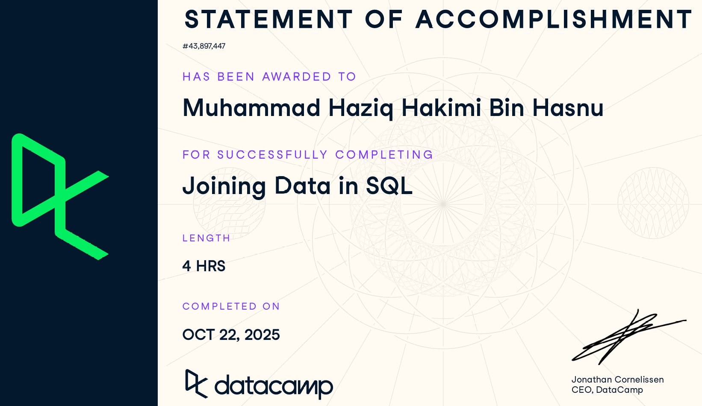
  </a>
  &nbsp;

  <!-- DataCamp - Introduction to SQL -->
  <a href="https://www.datacamp.com/completed/statement-of-accomplishment/course/e75dfcccfa038d7ff1858930130ef6f830ef831b?utm_medium=organic_social&utm_campaign=sharewidget&utm_content=soa">
    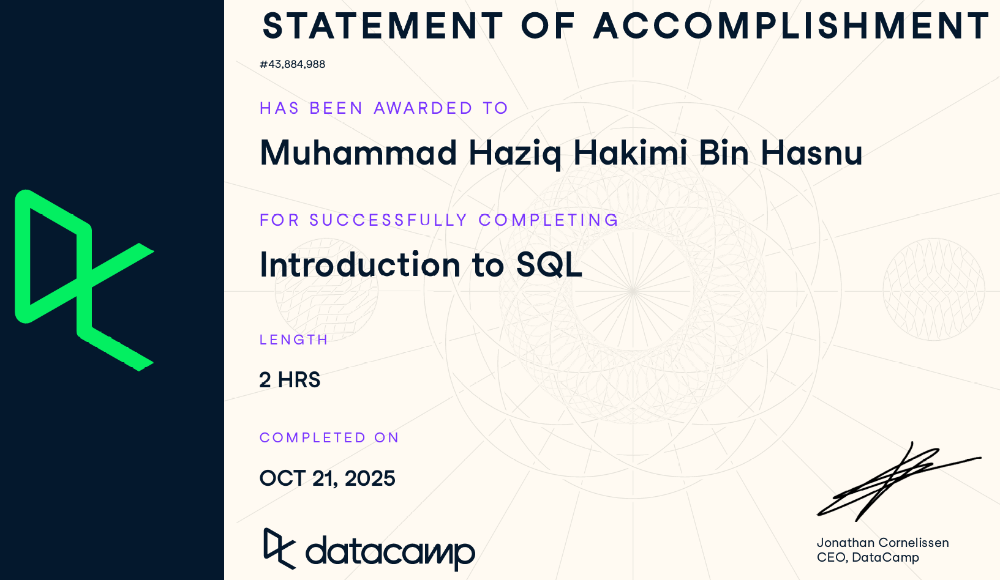
  </a>
  &nbsp;

  <!-- DataCamp - Intermediate SQL -->
  <a href="https://www.datacamp.com/completed/statement-of-accomplishment/course/4d6a44443a7cca1ecea25aef7bcd7b794973dd67">
    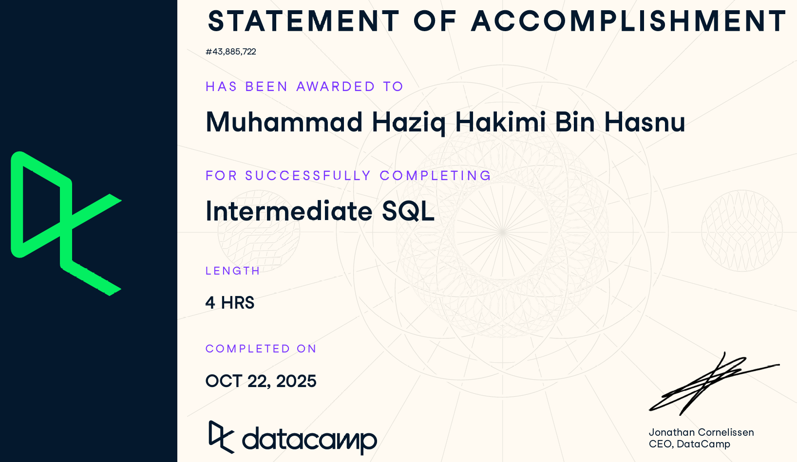
  </a>
  &nbsp;

  <!-- ===== SCRIMBA GROUP ===== -->
  <!-- The Frontend Developer Career Path -->
  <a href="https://scrimba.com/@ziqkimi308:certs;cert24zAwPPowRHt5op3bX549nK8bG1YMdce7H8D6">
    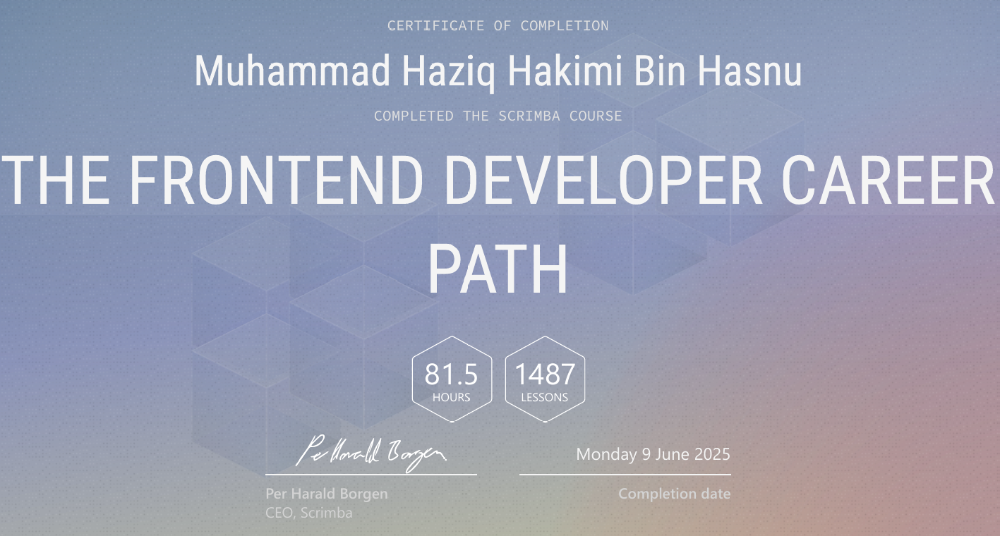
  </a>
  &nbsp;

  <!-- Learn React -->
  <a href="https://scrimba.com/@ziqkimi308:certs;cert24zAwPPowRHt5op3bX549nHtgKc6PBeQmDEBa">
    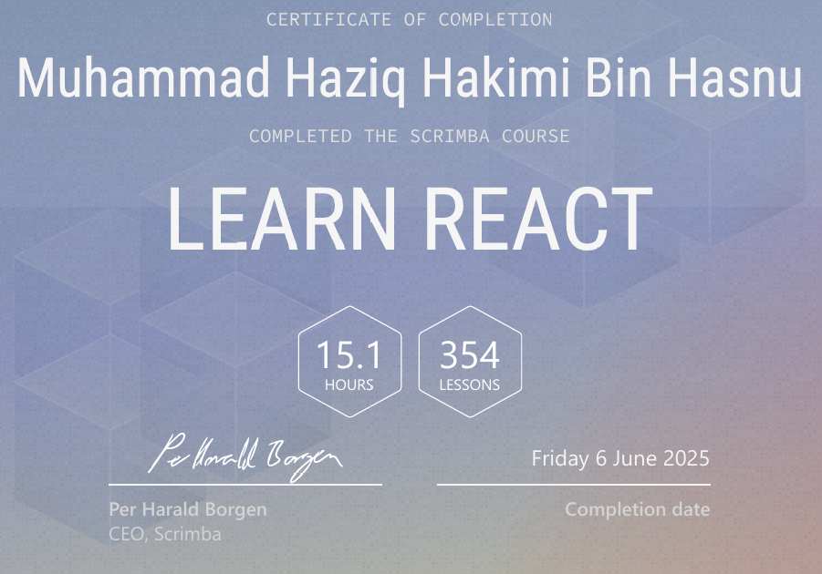
  </a>
  &nbsp;

  <!-- Advanced React -->
  <a href="https://scrimba.com/@ziqkimi308:certs;cert2JbLs3qgBCDWUDceTMkX2NTs1LeRJvChFfn1fb">
    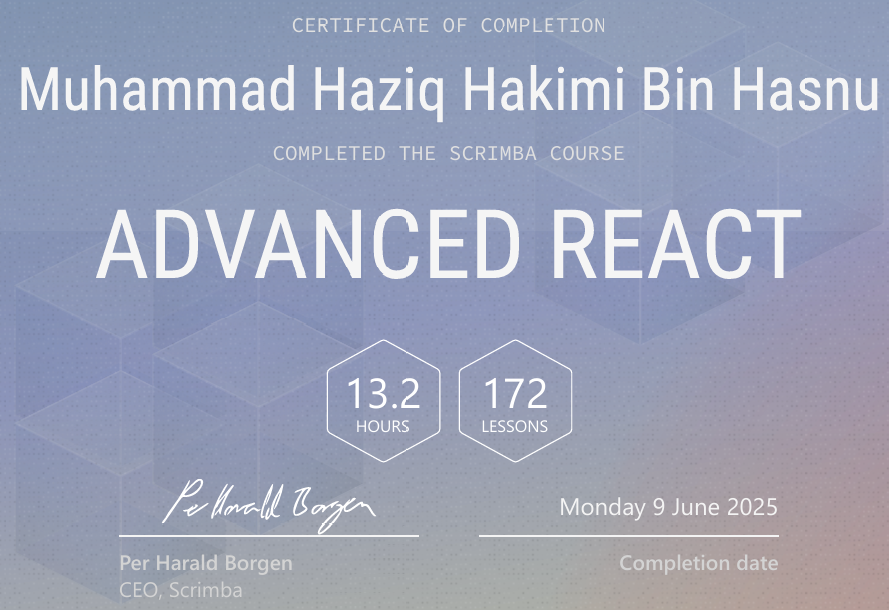
  </a>

 

## 🛠️ Tech Stack

### ☁️ Cloud DevOps & Systems

 

### 🌐 Web Development

 

### 🐍 Scripting & Tooling

 

## 📊 Informative Charts

  
---

*Always improving.*

